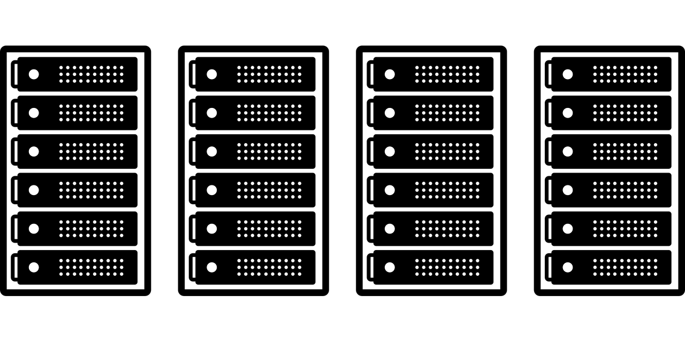
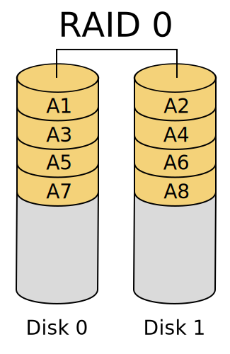
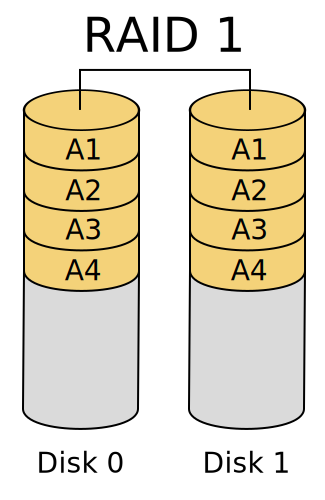
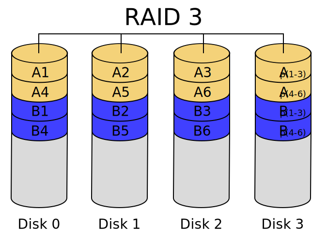

# RAID-protector

---


---

## Project Description
RAID-protector is a simulation project for RAID0, RAID1, and RAID3 arrays with fault injection and error handling capabilities. It includes a graphical user interface (GUI) for real-time monitoring, testing under various failure scenarios, and generating performance statistics. The goal is to simulate RAID systems, analyze fault tolerance, and measure performance impact under different conditions.

## Table of Contents
1. [Features](#features)
2. [Installation](#installation)
3. [Usage](#usage)
4. [Project Schedule](#project-schedule)
5. [Contributors](#contributors)
6. [License](#license)

## Features <a name="features"></a>
- **RAID Simulations**: Supports RAID0, RAID1, and RAID3 array types with 4 simulated disks.
- **Fault Injection**: Inject various types of errors (disk unavailability, sector failures, communication issues).
- **Error Handling**: Handle multiple error scenarios dynamically.
- **Performance Analysis**: Generate and display statistics for read/write operations under different RAID configurations.
- **Graphical Interface**: A GUI for managing the RAID systems, injecting errors, and viewing the state of each disk.
- **Documentation and Test Reports**: Full documentation and performance test results.

## Installation <a name="installation"></a>
1. Clone the repository:  
   ```bash
   git clone https://github.com/rafalgajos/RAID-protector.git
   ```
2. Navigate to the project directory:  
   ```bash
   cd RAID-protector
   ```
3. Install dependencies:  
   ```bash
   pip install -r requirements.txt
   ```
4. Run the application:  
   ```bash
   python main.py
   ```

## How RAID Works <a name="how-raid-works"></a>

### RAID0 (Striping)
RAID0 splits data evenly across multiple disks without redundancy. This increases data throughput as multiple disks can be read from or written to in parallel. However, since there is no data redundancy, the failure of any one disk results in the complete loss of data.



**Key points:**
- **Performance**: RAID0 significantly improves read/write speeds.
- **Fault Tolerance**: There is no fault tolerance. A single disk failure results in data loss.
- **Use Case**: Suitable for non-critical applications where performance is prioritized over data safety.

### RAID1 (Mirroring)
RAID1 duplicates the same data on two or more disks. This ensures that if one disk fails, the system can continue running using the remaining disk(s) with no data loss. The drawback is that storage capacity is halved, as all data is mirrored.



**Key points:**
- **Performance**: Read performance is improved as data can be read from multiple disks, but write performance is slightly reduced due to mirroring.
- **Fault Tolerance**: High, as data is duplicated. If a disk fails, the data remains accessible from the mirrored disk.
- **Use Case**: Suitable for critical applications where data integrity and availability are crucial, such as financial systems or databases.

### RAID3 (Striping with Dedicated Parity)
RAID3 stripes data across multiple disks and uses one dedicated disk for storing parity information. The parity disk stores information that can be used to reconstruct the data from a failed disk. This setup offers a balance between performance and fault tolerance, but the dedicated parity disk can become a bottleneck.



**Key points:**
- **Performance**: Faster than RAID1 for large sequential reads and writes, but slower than RAID0 due to parity calculations.
- **Fault Tolerance**: Moderate, as it can tolerate the failure of one disk.
- **Use Case**: Suitable for environments that require a balance between performance and data protection, such as video editing or large data storage with moderate risk tolerance.


## Usage <a name="usage"></a>
1. Start the application.
2. Select the RAID type (RAID0, RAID1, or RAID3).
3. Use the GUI to configure disks and simulate errors.
4. Monitor the state of the RAID array in real-time.
5. Generate performance reports and analyze results.

## Project Schedule <a name="project-schedule"></a>
- **Initial Planning**: Define project scope, gather requirements, and set up initial repository structure.
- **Architecture Setup**: Establish project modules and implement base RAID architectures.
- **RAID Simulation Implementation**: Implement RAID0, RAID1, and RAID3 with fault injection and error-handling mechanisms.
- **GUI Development & Testing**: Develop GUI for RAID monitoring and conduct functional and performance testing.
- **Finalization and Presentation**: Prepare complete documentation, perform final testing, and present the project.

## Contributors <a name="contributors"></a>
- **Natalia Brzezińska**
- **Rafał Gajos**

## License <a name="license"></a>
This project is protected under copyright law.  
Copyright 2024 Natalia Brzezińska, Rafał Gajos  
All Rights Reserved for the code.  
See the [LICENSE](LICENSE) file for more details.

The images used in this repository are licensed separately under different terms.  
See the [LICENSE-IMAGES](LICENSE-IMAGES.md) file for more details about the image licenses.

